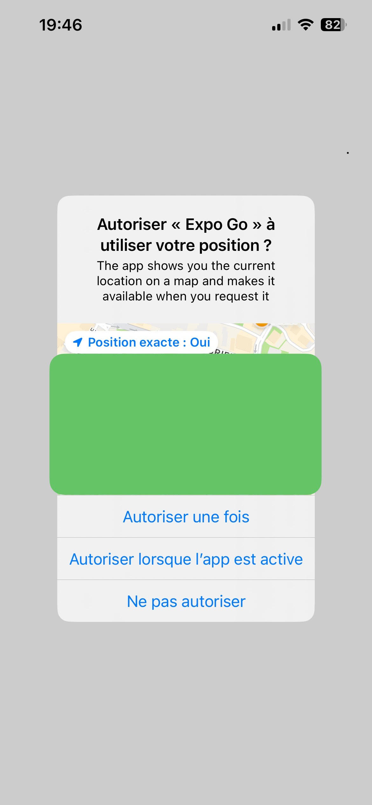
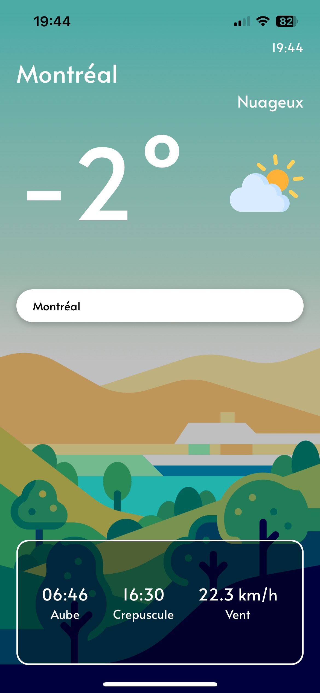
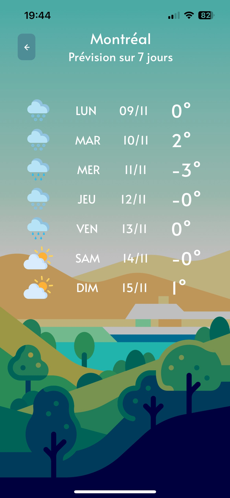
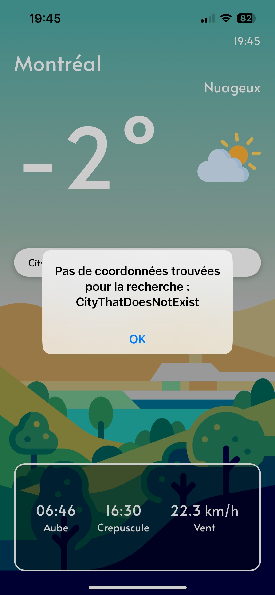

# Weather App — React Native (Intermediate/Advanced)

This is a simple but more advanced **Weather App** built with React Native and Expo.  
It displays real-time weather, daily forecasts, and allows location-based or manual city searches.  
Built as part of a learning journey following the Udemy course:  
[https://www.udemy.com/course/react-native-le-guide-du-debutant/](https://www.udemy.com/course/react-native-le-guide-du-debutant/)

## 🖼️ Screenshots

<p align="center">
  
  &nbsp;&nbsp;
  
  &nbsp;&nbsp;
    
  &nbsp;&nbsp;
    

</p>

## 🚀 Getting Started

### Prerequisites

- Node.js installed
- Expo CLI (`npm install -g expo-cli`)
- A device or emulator with Expo Go

### Installation

1. Clone this repository

2. Install dependencies

```bash
npm install
# or
yarn install
```

3. Launch the app with Expo

```bash
npx expo start
```

Scan the QR code with Expo Go or launch it in a simulator.

## 🧪 What’s inside

- Real-time weather display (temperature, icon, description)
- Sunrise, sunset, and wind speed info
- Tap on temperature to view 7-day forecast
- Search bar to look up another city
- Error handling when city is not found
- Location permission request and auto-detection

## 🛠️ Built with

- React Native
- Expo
- Axios
- JavaScript (ES6)

## 🎯 Learning Goals

- Practice using APIs and real-time data
- Manage permissions and location in React Native
- Create dynamic UIs based on async responses
